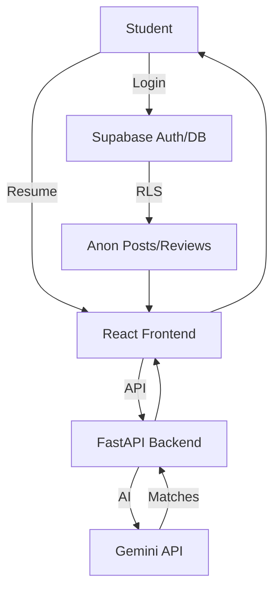
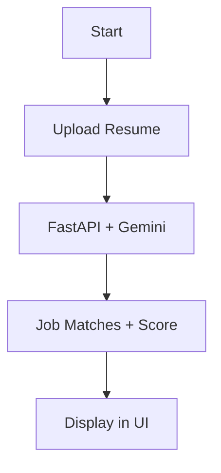

<xaiArtifact artifact_id="0cdbb0d4-9ba3-4d43-a275-d428b92a0a72" artifact_version_id="19a8ca37-c629-4b8c-b204-f239eb872e91" title="README.md" contentType="text/markdown">

# StudentWhisper: The Campus Brain

**Team:** Unicorn  
**Members:** Prabu Jayant (Full-Stack & AI), Elvis Vincent (Full-Stack & AI)
**Hackathon:** AUXIA Hackathon  
**Theme:** Software for College Campus  

## The Big Idea
StudentWhisper is a hyper-local, AI-powered platform that transforms the chaos of campus life into clarity. It’s a secure, anonymous hub where students share insights, access crowdsourced course and company reviews, and get personalized career guidance. Think of it as the campus’s collective brain—turning whispers into actionable knowledge. Built for students, by students, it’s the ultimate tool for navigating college with confidence.

## The Problem
Campus life is a maze. Students wrestle with:
1. **Scattered Intel:** Course and job insights are buried in group chats or nowhere at all.
2. **Career Fog:** Connecting skills to internships or jobs is a guessing game.
3. **Silenced Voices:** Fear of judgment stifles honest feedback.

Generic platforms like Reddit or LinkedIn don’t cut it—they’re too broad or too corporate. Campuses need software that’s local, secure, and smart.

## The Solution
StudentWhisper is a lean, campus-centric platform:
- **Anonymous Feed:** Share questions and experiences safely with auto-generated aliases.
- **Crowdsourced Reviews:** 5-star ratings for courses and local companies, built by students.
- **AI Career Engine:** Upload your resume; Google Gemini API delivers tailored job matches and a 0-100 compatibility score for courses/companies.
- **Slick & Secure:** React/Shadcn UI for smooth UX, Supabase for rock-solid auth and data.

This is the campus’s pulse, amplifying voices and powering smarter choices.

## Why We Win (AUXIA Criteria)
- **Creativity:** First-of-its-kind blend of anonymous networking and AI-driven career insights, hyper-focused on campus needs.
- **Execution:** Fully functional prototype, live at [Insert Demo Link], with a crisp video walkthrough [Insert Video Link]. Shipped in 48 hours.
- **Clarity:** Flowcharts and code snippets below make our approach crystal clear.
- **Code Quality:** Modular, type-safe (TypeScript), linted, tested. Clean and scalable.
- **AI/Tech Smarts:** Gemini API powers precise resume parsing; Supabase RLS ensures anonymity.

## Approach & Assumptions
**Approach:** We surveyed students, mapped pain points, and built an MVP: anonymous posting, reviews, and AI career guidance. React for speed, FastAPI for AI, Supabase for security. Iterated with student feedback for UX polish.  
**Assumptions:** Students have Node.js/Python, access Supabase/Gemini free tiers, use .edu emails for verification. Resumes are well-formatted; errors are handled gracefully. No raw resume storage post-analysis.

## Flowcharts
### System Architecture


### Career AI Flow


## Tech Stack
| Category   | Tech                              | Why It Rocks                                           |
|------------|-----------------------------------|-------------------------------------------------------|
| Frontend   | React, TypeScript, Vite, TanStack Query | Fast builds, type-safe, cached data for snappy UX.    |
| UI         | Shadcn/UI, Tailwind, Framer Motion | Accessible, rapid styling, smooth animations.         |
| Backend    | Python, FastAPI                   | Async power for AI calls, lightweight, scalable.      |
| AI         | Google Gemini API                 | Top-tier NLP for structured resume analysis.         |
| Database   | Supabase (PostgreSQL)             | Managed DB with RLS for ironclad anonymity.           |

## Setup
### Prerequisites
- Node.js (v18+), npm
- Python 3.8+, pip
- Supabase account
- Google Gemini API key

### Steps
1. **Clone**
   ```bash
   git clone https://github.com/your-repo/student-whisper
   cd student-whisper
   ```
2. **Backend (`localhost:6969`)**
   ```bash
   python3 -m venv venv
   source venv/bin/activate  # macOS/Linux
   .\venv\Scripts\activate  # Windows
   pip install -r requirements.txt
   echo "GEMINI_API_KEY=your_key" > .env
   uvicorn main:app --reload --port 6969
   ```
3. **Frontend (`localhost:5173`)**
   ```bash
   npm install
   echo -e "VITE_SUPABASE_URL=your_url\nVITE_SUPABASE_ANON_KEY=your_key" >> .env
   npm run dev
   ```
4. **Database**
   - Run `supabase/migrations/20250826050752_57277b93-dc5a-48e3-9a01-bdef665ffe9e.sql` in Supabase SQL Editor.
5. **Launch**: Open `http://localhost:5173`.

## Team
- **Prabu Jayant**: Full-Stack & AI
- **Elvis Vincent**:Full-Stack & AI

StudentWhisper is the campus’s heartbeat—smart, connected, and built to empower. Let’s redefine college life.


https://github.com/Elvis-NChalant/student-whisper/blob/main/src/Screenshot%202025-08-26%20134101.png

</xaiArtifact>
